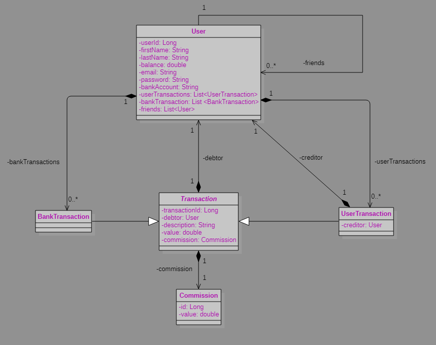
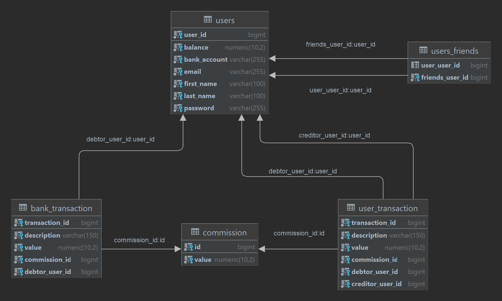

# Openclassrooms - Projet 6 : Création d'un application web de A à Z
## Contexte
<i>Pay my buddy</i> souhaite créer une application d'échange d'argent entre amis moyennant une commission à chaque transaction.

## Processus
### Elaboration de l'architecture de l'application et des User Stories
#### Diagrammes de classes
##### Modèle de classes

#### Modèle physique de données

### Implémentation du code
- Implémentation des modèles et des DTO
- Mise en place de la base de données PostgreSql
- Création des relations base de données entre les modèles
- Rédaction et validation des tests unitaires et d'intégration, avec introduction du TDD
- Implémentation de l'interface graphique avec Thymeleaf et Bootstrap
- Rédaction de la documentation avec JavaDoc
